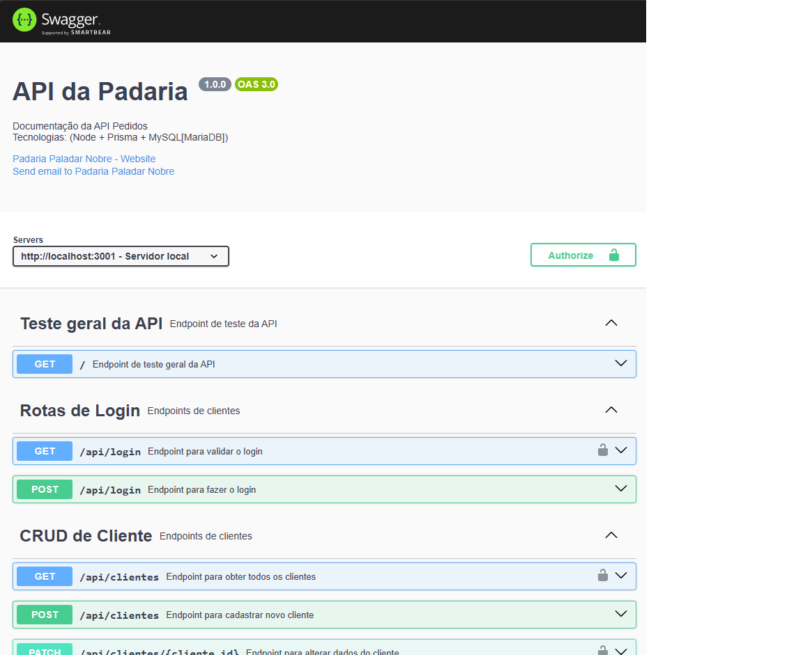

# API da Padaria


## Requisitos não funcionais
- [RN001] Linguagem de programação **JavaScript**;
- [RN002] Framework **Node.js**;
- [RN003] SGBD **MySQL(MariaDB)**;
- [RN004] ORM **Prisma**;
- [RN005] Documentação e testes unitários e de integração com **Swagger**;

## Passo a Passo
- 1 Crie uma pasta chamada `padaria-api` e abra com o Visual Studio Code.
- 2 Abra o terminal `cmd` ou `bash` do Visual Studio Code e execute o comando `npm init -y` para criar um arquivo package.json.
- 3 Instale as dependências basicas do projeto, instale o prisma com suporte ao MySQL.
```bash
npm install express cors dotenv
npm install prisma -g
npx prisma init --datasource-provider mysql
```
- 4 Crie o arquivo .env na raiz do projeto contendo
```js
DATABASE_URL="mysql://root@localhost:3306/estacionamentoapi?schema=public&timezone=UTC"
```
- 5 Edite o Shema do Prisma no arquivo `prisma/schema.prisma` para definir as tabelas.
- 6 Crie e edite o arquivo `server.js` somente com o básico por enquanto, e `router.js` para definir as rotas da API.
- 7 Crie a pasta `src` e dentro dela crie o arquivo `router.js` para definir as rotas da API.
- 8 Execute o comando `npx prisma migrate dev --name init` para criar as tabelas no banco de dados MySQL.<br>Se precisar resetar o prisma o comando é `npx prisma migrate reset`.
- 9 Execute a API e teste a rota inicial no navegador ou Insomnia.
```bash
npx nodemon
```
- 10 Crie e edite os arquivos de controle para gerenciar os automóveis e as estadias.
- 11 Importe os controladores no arquivo `router.js` e defina as rotas para cada recurso.
- 12 Instale o Swagger para documentar a API.
```bash
npm install swagger-jsdoc
npm install swagger-ui-express
```
- 13 Instale o jwt e bcrypt para configurar a proteção de login da API.
```bash
npm install jsonwebtoken
npm install --save-dev @types/jsonwebtoken
npm install bcrypt  
npm install --save-dev @types/bcrypt      
```
- 14 Altere o arquivo `server.js` para incluir a documentação do Swagger.
- 15 Crie o arquivo `swagger.json` na pasta raiz para configurar o Swagger.
- 16 Execute a API novamente e acesse a documentação.
<br>

